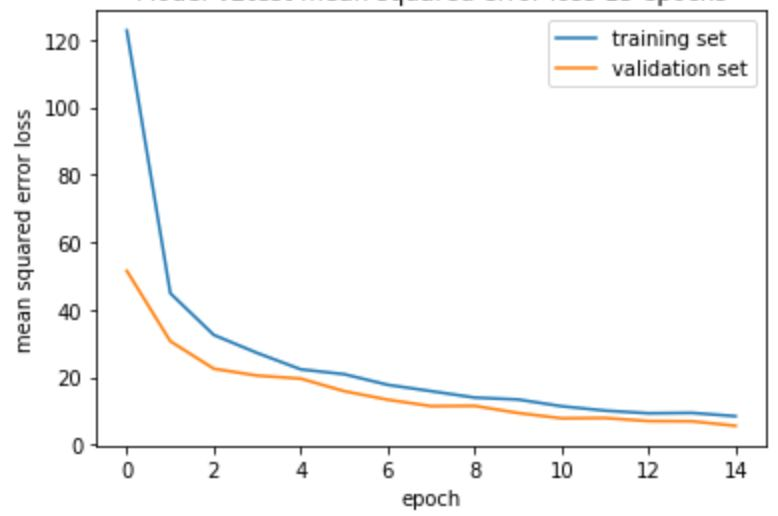

# Vision-based Vehicle Speed Estimation

CIVIL-459 Final Project: Vision-based Vehicle Speed Estimation

This work is a part of ”Building AV Autopilot” Project of CIVIL-459 course at EPFL.

This work is aim to solve this problem by estimating the ego vehicle speed using only frames from a single front-facing monocular camera with a mask of the lane to preserve spatiotemporal features as input and receive high performance of vehicle speed estimation as output.

Overall, this README provides an overview of the dataset, data augmentation techniques, model architectures, training details, and the best model with its corresponding hyperparameters.

## Result

https://github.com/vita-student-projects/vision-based_vehicle_speed_estimation_gr26/assets/99803920/ae21e893-207d-4c84-a186-b83329f63e8c

Note that this is the result when the network is purely trained on comma.ai data and tested on train.mp3 data with completely different lighting conditions and different scene dynamics. Most of the error on the train.mp3 footage occurs at the turns, which is limitedly seen in comma.ai [https://www.comma.ai] dataset

## Validation Loss during train model

 Mean Square Error loss of train and validation dataset

In this particular project, we have chosen to utilize the **Mean Squared Error (MSE)** as our loss function. The reason behind this choice stems from the nature of our task, which involves predicting the speed. In this context, speed prediction is considered a regression problem, where the goal is to estimate a continuous value rather than a categorical or discrete outcome.

**Result** : By achieving an MSE of around 5 across the validation sets, we can have increased confidence in the reliability of our speed prediction system, as it demonstrates a relatively small average deviation from the true speed values.

## Files Structure:

    Vision-based Vehicle Speed Estimation
    |
    |____data
    |      |
    |      |____labels.txt              - ground truth of train data (train.mp4) from comma.ai website
    |
    |____Speed_Estimation.ipynb         - final pipeline (includes only 3D CNN)
    |
    |____Speed_Estimation_v2.0.ipynb    - pipeline with more debug details
    |
    |____work_space_speed_est.ipynb     - source-working notebook (includes traininig records)
    |
    |____labels.txt                     - ground truth of train data (train.mp4)
    |
    |____cnn_network.png                - architecture of 3DCNN model
    |
    |____requirements.txt               - required libraries
    |
    |____mse_loss.png                   - graphic of mse loss on train and test data

## Dataset

DataSet used in this work was reuqired from the speed prediction challenge posted by https://comma.ai/. The available of this data set can find on comma.ai website [https://goo.gl/ERi7Uh]. This Dataset consists of 17 minuntes video (**train.mp4**) from a single front-facing monocular camera from Hyundai Sonata and labels (**labels.txt**) for each frame. In nutshell, this DataSet has 20400 frames which each frame has value of speed as label.

## Usage

1. Download the weights pretrained on the Sports-1M dataset [https://goo.gl/tsEUo2]  - wights of the pre-trained 3DCNN model on "SportM1" datas
2. Download the training data from comma.ai website [https://goo.gl/ERi7Uh]  - ground truth of train data (train.mp4)

3. Download on Google Drive the final weights of 3D CNN model to repoduce result. Google Drive link : [https://drive.google.com/drive/folders/1kDo8S_IP6Em5-IjpCo0irVqbNUr7W0wX?usp=sharing] wights of the final model (3D CNN)

4. Download the file **requirements.txt** with required libraries to run notebooks

Choose further manipulation : :

5.1 **Reproduce best result** : Follow the steps in **Speed_Estimation.ipynb** to reproduce result

5.2 **Try to train by yourself** : Follow the steps in **Speed_Estimation_v1.0.ipynb** for a walk-through of the training and testing of the network

5.3 **See all works including training attamps for all models** : **Work_space_speed_estimation.ipynb** - source-working notebook with all models and their training result

## The Best Model: 3D CNN Architecture

The architecture of best model: 3D CNN

The 3D Convolutional Neural Network (CNN) architecture is our best model for video analysis and processing. It excels at capturing both spatial and temporal information, enabling it to understand complex motion dynamics and learn fine-grained patterns. The 3D CNN's enhanced feature extraction and robustness to spatio-temporal variations make it highly effective in tasks such as speed prediction. Our model is related on **2022 state-of-the-art work "Ego Vehicle Speed Estimation using 3D Convolution with Masked Attention”** by Mathew, A.M. and Khalid,T. [https://arxiv.org/pdf/2212.05432.pdf]. Additionally, the availability of the pretrained model on "SportM1" dataset allows for efficient transfer learning, leading to improved performance even with limited training data.

## Contributions:

### Dataset

- The dataset used for this project consists of a collection of images and corresponding labels representing the speed of the objects captured in the images.
- The dataset contains a total of 20400 images.
- The source of the dataset is video from comma.ai challenge **\*train.mp** with labels for each frame **labels.txt**.
- To ensure proper evaluation of the model's performance, we split the dataset into a training set and a test set. The training set consists of 90% of the images, while the remaining 10% of the images are allocated to the test set.

### Data Augmentation

- Various data augmentation techniques were employed to enhance the diversity and generalization capabilities of the training data.
- The augmentation techniques applied include random brightness changes, random CoarseDropout, and random Dropout. These techniques help in simulating different lighting conditions and occlusions that can occur in real-world scenarios.

### Architectures and Model Selection

- Four different architectures were considered for the task: 3DCNN, 3DCNN + GRU, 3DCNN + LSTM, and ResNet18.
- The 3DCNN architecture was chosen as the baseline model, while the other architectures were explored to capture temporal dependencies.
- The number of parameters for each model is as follows: ResNet18 : 511,425, 3DCNN: 77,999,873, 3DCNN + LSTM and GRU : 48,181,889.
- The motivation behind using these specific models was to investigate the effectiveness of different architectures in capturing spatio-temporal features and improving performance in speed prediction tasks.

### Training Details

- Hyperparameters were carefully selected for training the models.
- Two optimizers were used: SGD and AdamW.
- As the problem is regression-based, mean squared error (MSE) was chosen as the criterion for model training.
- Batch sizes of 4, 12, and 32 were experimented with.
- Different learning rates were tested: 1e-3, 1e-4, and 1e-5.
- Early stopping based on validation loss was implemented to prevent unnecessary training.

### Results

#### Overfitting Analysis

- During the training process, it was observed that the 3DCNN + GRU and 3DCNN + LSTM models tended to overfit the training data.
- The ResNet18 model was trained without fine-tuning and required a larger number of epochs to converge

### Imbalance Problem in Dataset

- The dataset exhibits an imbalance issue where the average speed is 10 km/h.
- Specifically, there are only 20 images for a speed of 26 km/h, while 15,000 images correspond to a speed of 10 km/h ± 3.
- Additionally, there are 5,000 images for small speeds ranging from 3 to 5 km/h.

### Best Model and Hyperparameters

- After extensive experimentation, the best-performing model was determined to be the 3DCNN architecture.
- The optimal configuration for the best model included a timestep of 16, a batch size of 4, and the AdamW optimizer.Additionally, it should be noted that the 3DCNN model, which was selected as the best model, incorporates dropout layers in its structure. Dropout is a regularization technique used to prevent overfitting by randomly deactivating a fraction of the neurons during training. The inclusion of dropout layers in the 3DCNN model helps to enhance its generalization capability and improve its performance in speed prediction tasks.

## TO DO NEXT

1. Use shorter look-back time window to allow more fine-grained speed prediction. At the moment, the network looks 16 frames back in time and predicts the average speed during this period.

2. Use semantic segmentation to cut off moving objects. Moving objects such as vehicles confuses the speed prediction w.r.t. the road. More data with diverse conditions may also be able to clear this issue.
